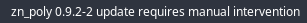

# arch_linux_news

Reads the RSS feed of archlinux.org news and warns when a new entry has been added. When keeping an Arch system up to date, it is important to regularly check Arch Linux News in order to know when manual intervention might be necessary.

This script keeps a file containing the date of the last news that was read (i.e. clicked on) in the ~/.cache folder.

Clicking on the bar will open the latest archlinux news page in the default browser.

## Previews




## Dependencies

* feedparser

## Installation
```
$ pip install feedparser
```
* Give the script execution permission (`chmod 755 arch_linux_news`)
* Copy or symlink (symlink will give you latest changes to the repository) the script into your scripts directory (~/.config/i3blocks/scripts for example)
* Add to your i3blocks conf (~/.config/i3blocks/config):
```ini
[arch_linux_news]
command=$SCRIPT_DIR/arch_linux_news
interval=30
```
