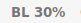

# backlight

Show backlight brightness.



# Dependencies

* `xbacklight`

# Installation

To use with i3blocks, copy the blocklet configuration into your i3blocks configuration file.

# Config

```
[backlight]
command=$SCRIPT_DIR/backlight 
interval=10
LABEL=BL 
#LABEL=☀
```
