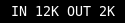

# bandwidth

Show bandwidth information. Some interfaces report unknown instead of up for
their state. If you would like to treat unknowns as up, then set 
`TREAT_UNKNOWN_AS_UP=1`.



# Config

```
[bandwidth]
command=$SCRIPT_DIR/bandwidth
interval=5
#INTERFACE=eth0
#INLABEL=IN 
#OUTLABEL=OUT 
#TREAT_UNKNOWN_AS_UP=0
```
