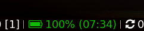
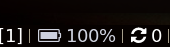
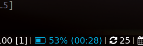
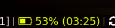

# battery-icon-bar 

Show the current status of your battery, but with a dynamic battery icon.
Estimates remaining battery time and charging time.
Configurable colors. configurable threshold for suspending the system.

Usage: battery-bar-icon [OPTION] color
        When discharging, there are 8 [1-8] levels colors.
        You can specify custom colors, for example:

        batterybar -1 red -2 "#F6F6F6" -8 green

        You can also specify the colors for the charging, AC and
        charged states:

        batterybar -c green -f white -a "#EEEEEE"











# Dependencies

font-awesome, acpi, systemd (for powering down), i3lock-wrapper (optional, for locking screen when powering down)

# Installation

To use with i3blocks, copy the blocklet configuration in the given `i3blocks.conf` into your i3blocks configuration file, the recommended config is

```INI
[battery-bar-icon]
command=$SCRIPT_DIR/battery-bar-icon
markup=pango
interval=persist
```
