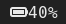
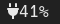
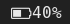

## battery-duo
Simple module showing battery percentage on systems with one or two batteries(such as Thinkpad with Power Bridge). Features 4 options to display current battery capacity.

Display with Unicode Emojis



Display with Font Awesome/Nerd-Fonts

 

Simple Display


Display only percentage


## Features
* caluculates current capacity through /sys/class/power_supply
* configuration of display through arguments

## Dependency
* if you'd like to use battery-duo -a you do need font awesome or nerd fonts

## Setup
Download at least the battery-duo script file and place in a Direcotry you desire. Make it executable with *chmod +x battery-poly*. Add the following to your i3blocks config and modify to your liking:
```
[battery-duo]
command=/path/to/file/battery-duo
interval=5
```
the example given will display the precentage and an unicode emoji based on if the the battery is charging or not.

Alternativly you can choose to display the battery percentage with a font awesome symbol. Here it will also change the symbol based not just on whether or not the battery is charging but also based on how empty or how full the battery is:
```
[battery-duo]
command=/path/to/file/battery-duo -a
interval=5
```

To display just BAT infront of the percentage use argument *-s* (for simple).
To display just the percentage use option *-0*.


Please do modify to your liking and or contribute.

