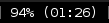
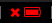

# battery 

Show the current status of your battery.







# Dependencies

fonts-font-awesome, acpi, python3

# Installation

To use with i3blocks, copy the blocklet configuration in the given `i3blocks.conf` into your i3blocks configuration file, the recommended config is

```INI
[battery]
command=$SCRIPT_DIR/battery
markup=pango
interval=30
```
