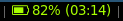
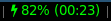

# battery3

Prints the battery status to the status bar.
This is a copy of the i3blocks standard battery blocklet, enhanced with fontawesome-icons.





# Dependencies

* fontawesome
* perl
* acpi

# Installation

* Copy the script into your directory of choice, e.g. ~/.i3blocks/blocklets
* Give it execution permission (`chmod +x battery3.pl`)
* Add the script to your i3blocks.conf, for example like this:

```ini
[battery]
command=$SCRIPT_DIR/battery.pl
interval=5
```
