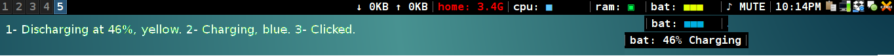

# batterybar

Display the battery level in a set of five unicode squares (U+25A0).


	
It also changes color for more accuracy and to distinguish between charging, 
discharging, charged, and AC statuses.

You can also specify your own set of colors.
	
Left-clicking briefly shows the battery level in percent.
	
# Dependencies

* acpi

# Installation

* Copy the batterybar script into your directory of choice, e.g. ~/.i3blocks/
* Give it execution permission (`chmod +x batterybar`)
* Add the following blocket to your i3blocks.conf:

```ini
[batterybar]
command=$SCRIPT_DIR/batterybar
label=bat:
interval=5
markup=pango
min_width=bat: ■■■■■
# Discharging colors low to high
#C1=#FF0027
#C2=#FF3B05
#C3=#FFB923
#C4=#FFD000
#C5=#E4FF00
#C6=#ADFF00
#C7=#6DFF00
#C8=#10BA00
#CHARGING_COLOR=#00AFE3
#FULL_COLOR=#FFFFFF
#AC_COLOR=#535353
```
