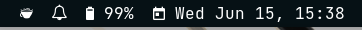
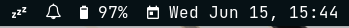

# i3 Focused window

Displays title of focused window in i3Wm





# Requirements

Dependencies: `xfce4-power-manager`, nerd fonts for icons


# Usage

Clicking the coffee cup icon will toggle caffeinate mode.

# Installation

The recommended i3blocks config is

```ini
[caffeine]
command=./caffeine
interval=once
markup=pango
format=json
```