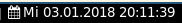
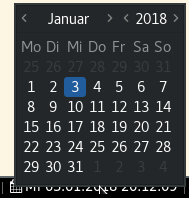

# calendar

Shows the current date and time. When clicked, a calendar popup is created.

This is similar to the rofi-calendar blocklet, but without the rofi dependency and with a slightly more advanced popup (at least in my opinion).





# Dependencies

* yad
* xdotool (for positioning of the popup)

# Installation

* Copy the script into your directory of choice, e.g. ~/.i3blocks/blocklets
* Give it execution permission (`chmod +x calendar`)
* Add the script to your i3blocks.conf, for example like this:

```ini
[calendar]
command=$SCRIPT_DIR/calendar
interval=1
LABEL= 
DATEFMT=+%H:%M:%S
# SHORTFMT=+%H:%M:%S
HEIGHT=180
WIDTH=220
```

* Add `for_window [class="Yad"] floating enable` to your i3 config file.
Unfortunately this is neccessary [because of a bug in `yad`](https://sourceforge.net/p/yad-dialog/tickets/301/).
You may skip this step if you want to open the calendar popup as a normal tile instead.

# Configuration

Parameters _[deprecated!]_:

* `-f FMT`: date/time format (default _+%a %d.%m.%Y %H:%M:%S_)
* `-W WIDTH`: width of the window (default _200_)
* `-H HEIGHT`: height of the window (default _200_)

Additionally you may want to

* change the placement of the popup
* change the parameters for `yad` to change the appearance of the popup
