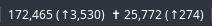

# corona_stats

Shows the updated cases and deaths of the Covid 19 virus, along with the daily change. The script downloads data daily to a local file (in ~/.cache).

Click on the bar to display a graph: left-click for the cases, right-click for the deaths.

In status bar:



When clicked:


# Dependecies

* matplotlib

# Installation

* Give the script execution permission (`chmod 755 corona_stats`)
* Copy or symlink (symlink will give you latest changes to the repository) the script into your scripts directory (~/.config/i3blocks/scripts for example)
* Add to your i3blocks conf (~/.config/i3blocks/config):
```ini
[corona_stats]
#commented are defaults
command=$SCRIPT_DIR/corona_stats
#COUNTRY=France
interval=5
```
