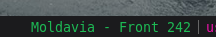
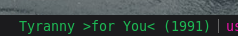

# current-spotify-song

Display the song currently playing in Spotify. When clicked, display the album name and release year.





# Dependencies

* `python3`
* A [Spotify developer app](https://developer.spotify.com/dashboard/applications) with `client_id` and `secret`
* A premium Spotify account

# Installation

Spotifys API requires Oauth authentication. This script includes a setup wizard that will help you set this up.

* Copy the script to your directory of choice, e.g. `~/.config/i3blocks/scripts/`
* Run the setup wizard `current-spotify-song setup`
* Enter your `client_id` and `secret` you got from your Spotify developer app.
* Open the promted link and the instructions to allow your app to access your Spotify account.
* When promted with `Setup completed` close the wizard with `CTRL + C`

The wizard will store some requierd data to `~/.config/current-spotify-song`.

* The `app` file will include your `client_id` and `secret`.
* The `tokens` file will include your current Spotify access token and a refresh token used to issue a new token when the previous has expired.

# Configuration
```
[current-spotify-song]
command=$SCRIPT_DIR/current-spotify-song
interval=5
color=#1DB954

# How many artists to display, 'all' or number e.g '2'
artists=all

# Maximum length of the song name (excluding artists)
# Will add three dots at the end of song name e.g 'There Is No...'
max_length=20
```

# License

MIT License

```
Copyright 2020 Andreas Palm

Permission is hereby granted, free of charge, to any person obtaining a copy of this software and associated documentation files (the "Software"), to deal in the Software without restriction, including without limitation the rights to use, copy, modify, merge, publish, distribute, sublicense, and/or sell copies of the Software, and to permit persons to whom the Software is furnished to do so, subject to the following conditions:

The above copyright notice and this permission notice shall be included in all copies or substantial portions of the Software.

THE SOFTWARE IS PROVIDED "AS IS", WITHOUT WARRANTY OF ANY KIND, EXPRESS OR IMPLIED, INCLUDING BUT NOT LIMITED TO THE WARRANTIES OF MERCHANTABILITY, FITNESS FOR A PARTICULAR PURPOSE AND NONINFRINGEMENT. IN NO EVENT SHALL THE AUTHORS OR COPYRIGHT HOLDERS BE LIABLE FOR ANY CLAIM, DAMAGES OR OTHER LIABILITY, WHETHER IN AN ACTION OF CONTRACT, TORT OR OTHERWISE, ARISING FROM, OUT OF OR IN CONNECTION WITH THE SOFTWARE OR THE USE OR OTHER DEALINGS IN THE SOFTWARE.
```