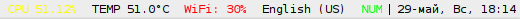
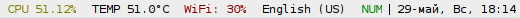

# dimmer
## Description

Without dimmer:



With dimmer:



This script is not an independent blocklet and meant to use as filter with any
i3blocks blocklets.

dimmer useful if your bar have light background color and you want to use
colored blocklets made for dark background.

dimmer parses a blocket output, gets strings with hex color codes and reduces
it values to make colors darker.

## Usage

To use dimmer you should add it through pipe, e.g. you may keep following in
your i3blocks.conf:

```ini
[dimmer]
# Global properties
command=(/usr/lib/i3blocks/$BLOCK_NAME ; echo) | $SCRIPT_DIR/dimmer
```

echo is required for properly support of some scripts that does not produce new
line symbol on the end of their output (like bandwidth blocklet).

## Options

By default dimmer will reduce color values to 50%. Also dimmer supports custom
brightness values in percents as an argument, e.g.:

```
dimmer 72
```

This will reduce values to 72% of origin.
