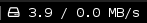

# disk-io

Monitor disk reads and writes.




# Dependencies

iostat (sysstat package), fontawesome for the   hard disk icon (fonts-font-awesome package)

# Usage

```
[disk-io]
command=$SCRIPT_DIR/disk-io
#command=$SCRIPT_DIR/disk-io -w 3 -M -P 0
interval=persist
markup=pango
LABEL=
#instance=/^sda/
#DT=5
#MB_ONLY=0 #0 or 1
#KB_ONLY=0 #0 or 1
#WIDTH=4
#MB_PRECISION=1
#KB_PRECISION=0
#REGEX=/^(s|h)d[a-zA-Z]+/
#THRESHOLD=0
#WARN_COLOR="#FF0000"
#SEPARATOR=/
#PREFIX=
#SUFFIX="B/s"
```


# Options

The default output is "read / write (k|M)B/s". 
If `-R` is not used, the `$BLOCK_INSTANCE` variable, if specified, will be the chosen regex to match against devices.
This allows watching specific devices by e.g. setting `instance=/^sda/`
or `instance=/^sd[ab]/`.

```
Usage: disk-io [-t time] [-w width] [-p kB_precision] [-P MB_precision] [-R regex] [-s separator] [-S] [-T threshold [-C warn_color]] [-k|-M] [-l] [-h]
Options:
-L	Label to put in front of the text. Default: 
-t	Time interval in seconds between measurements. Default: 5
-w	The width of printed floats. Default: 4 
-p	The precision of kB/s floats. Default: 0 
-P	The precision of MB/s floats. Default: 1
-R	Regex that devices must match. Default: /^(s|h)d[a-zA-Z]+/
-s	Separator to put between rates. Default: /
-S	Short units, omit B/s in kB/s and MB/s.
-T	Rate in kB/s to exceed to trigger a warning. Default: not enabled
-C	Color to change the blocklet to warn the user. Default: #FF0000
-l	List devices that iostat reports
-M	Do not switch between MB/s and kB/s, use only MB/s
-k	Do not switch between MB/s and kB/s, use only kB/s
-h	Show this help text
```
