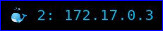

# docker

Show the number of running `Docker` containers and latest created container IP address.



# Dependencies

*docker* 

# Config

```
[docker]
command=$SCRIPT_DIR/docker
label=🐳
color=#0db7ed
interval=10
```
