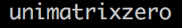

# essid

Shows the ESSID that you are connected to.
If no interface is specified, wlan0 is used.
Shows nothing if you are not connected.

This script depends on `iwconfig`.



# Config

```
[essid]
command=$SCRIPT_DIR/essid
interval=60
#INTERFACE=wlan0
```
