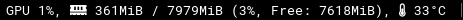
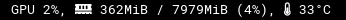
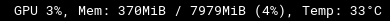

# gpu-info
Displays more detailed information on NVIDIA GPUs by querying `nvidia-smi`.



```
[gpu-info]
label=GPU 
interval=5
# Uses FontAwesome Icons when True
USE_ICON=True
# Shows free memory when True
SHOW_FREE_MEMORY=True
```
Turning off `SHOW_FREE_MEMORY` produces:



Turning off `USE_ICON` produces:


