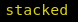

# i3 Current layout

Displays i3 layout mode of the current window

Example:





## Requirements

Dependencies: `jq`

## Installation

The recommended i3blocks config is

```INI
[i3-current-layout]
command=$SCRIPT_DIR/i3-current-layout
color=#DCD427
interval=1
```
