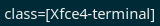

# i3 Focused window

Displays title of focused window in i3Wm



# Requirements

Dependencies: `xprop`, `awk` 

# Command line arguments  

```bash
i3-focusedwindow [maximum length to display]
```

Blank for unlimited length, i.e. output line can occupy all available space.

# Installation

The recommended i3blocks config is

```INI
[i3-focusedwindow]
label=[]= 
command=$SCRIPT_DIR/i3-focusedwindow 20
interval=persist
```
