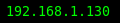

# iface

Show network interface status.
If the instance is not specified, it uses the interface for the default route.
Specify ipv6, ipv4, or either by setting `ADDRESS_FAMILY` to 
`inet6`, `inet`, or `inet6?`.

If an invalid interface is specified, nothing is printed.





# Config

```
[iface]
command=$SCRIPT_DIR/iface
#LABEL=wlan0:
#IFACE=wlan0
#ADDRESS_FAMILY=inet6?
color=#00FF00
interval=10
```
