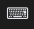

# key_light

Control the keyboard backlight. When clicked, the keyboard backlight is
increased until the maximum level is reached after which the backlight is
turned off.



# Dependencies

* [upower](https://upower.freedesktop.org/)

# Config

```
[key_light]
full_text=⌨
command=$SCRIPT_DIR/key_light
```
