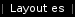
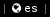

# keyboard-layout
Shows the currently active keyboard layout.




# Dependencies

* [xkblayout-state](https://github.com/nonpop/xkblayout-state)
* FontAwesome (optional) for label

# Config
```
[keyboard-layout]
command=$SCRIPT_DIR/keyboard-layout
label=Layout
#label=
interval=10
```
