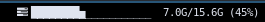

# memory2
Display memory usage as a bar rendered with utf8 characters.




Features:
customizable warning and critical color levels
customizable size
customizable characters

## Build

```
make
```

### Config
```ini
[memory2] 
interval=persist
markup=pango
bar_chars=_▁▂▃▄▅▆▇█ 
#bar_size=10
#critical=80
#warning=50
#color_critical=#FF7373
#color_warning=#FFA500
```

E.g.
```ini
[memory2]
label= 
interval=persist
markup=pango
bar_chars=_▏▎▍▌▋▊▉██
bar_size=20
critical=50
warning=20
color_critical=#d9534f
```