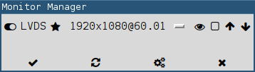

# monitor_manager

Quickly manage your monitors. 
This script supports: on/off, blank/unblank,
extend, clone, set primary, change output mode,
rotate, reflect, adjust brightness.



# Dependencies

python3, python3-tk, xrandr, fontawesome (fonts-font-awesome package), arandr suggested but not required.

# Usage

Add the following to your i3blocks config:

```
[monitors]
command=$SCRIPT_DIR/monitor_manager
interval=once
#SHOW_ON_OFF=1
#SHOW_NAMES=1
#SHOW_PRIMARY=1
#SHOW_MODE=1
#SHOW_BLANKED=1
#SHOW_DUPLICATE=1
#SHOW_ROTATION=1
#SHOW_REFLECTION=1
#SHOW_BRIGHTNESS=1
#SHOW_BRIGHTNESS_VALUE=0
#SHOW_UP_DOWN=1
#FONT_FAMILY=DejaVu Sans Mono
#FONT_SIZE=11
#CLOSE_TO_BOUNDARY_BUFFER=20
```
