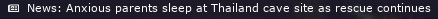

# News

Shows news and adds a shortcut to access them in your browser. It uses [newsapi.org](https://newsapi.org) for api requests.




# Dependencies

- [requests](https://pypi.org/project/requests/)


# Usage

### Get an API key
Update script with your own API key from [newsapi.org](https://newsapi.org) 
```ini
api_key = "API_KEY_HERE"
```

### Choose the news sources
You can select one / or several source provider(s), get provider codes from here [newsapi.org/sources](https://newsapi.org/docs/endpoints/sources) Edit file, add sources separeted by comma

```ini
sources="ign,bbc-news"
```

Insted sources, you can filter results by country
```ini
country="us"
```

**Note** you can only filter either by sources or country, API doesn't support both, so leave one empty

# Config

```ini
[news]
command=~/.config/i3blocks/news
interval=900
```


