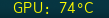

# nvidia-temp

Display the current temperature of an NVIDIA GPU



## Dependencies

nvidia-settings

## Config

```
[nvidia-temp]
command=$SCRIPT_DIR/nvidia-temp
#instance=0 #May need to manually specify which card to use
label=GPU:
interval=10
WARNING=60
WARNINGCOLOR=#ffff00
CRITICAL=80
CRITICALCOLOR=#ff0000
NOCOLOR=0
```

## Usage

```
Usage: nvidia-temp [-t warning_temp] [-T critical_temp] [-w warning_color] [-c critical_color] [-h]
Options:
-t	Temperature threshold to trigger warning color (Default 60)
-T	Temperature threshold to trigger critical color (Default 80)
-w	Color for warning temperature (Default #ffff00)
-c	Color for critical temperature (Default #ff0000)
-n	Disable color printing
-h	Display usage information
```
