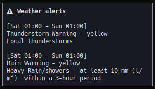

# openweather

Show weather information using [OpenWeather](https://openweathermap.org/) API.


The blocklet will show a warning symbol if there are any weather alerts. Left click on the blocklet will send a notification with details for every alert:



## Setup / Usage

Before you start, obtain an API key that has the permissions to query the [OpenWeather OneCall 3.0 API](https://openweathermap.org/api/one-call-3). Save the key to a file and set the API key path in the blocklet configuration. 

Suggested i3blocks configuration (matching the blocklet image above):
```
[openweather]
# Get city coordinates by using:
# http://api.openweathermap.org/geo/1.0/direct?q={CITY}&limit=2&appid={API_KEY}
LAT=44.8178131
LON=20.4568974
APIKEY_PATH=/path/to/your/api/key
command=$SCRIPT_DIR/openweather
interval=1800
color=#7275b3
```

## Dependencies

- `wget` - to send requests to the OpenWeather API
- `jq` - to parse OpenWeather API response

