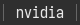

# optimus-manager

Show current GPU using optimus-manager. Changes GPU on block click.




# Dependencies
- [optimus-manager](https://github.com/Askannz/optimus-manager)

# Config
```
[optimus-manager]
command=$SCRIPT_DIR/optimus-manager
interval=30
```
