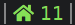

# purpleair

Get air quality readings from [PurpleAir](http://purpleair.com) sensors.



# Requirements

Dependencies: perl, curl, jq

# Configuration

A purpleair config block looks like this:

```INI
[purpleair]
label=
command=$SCRIPT_DIR/purpleair
interval=60
SENSOR_ID=78305
#TYPE=US_AQI
#COLORS=#85df56,#fbcf4b,#f28c33,#dd4d3c,#cf79e0,#9b2f6a
#NO_COLOR=true
```

## Finding a sensor ID

If you do not own a PurpleAir sensor, there may be one near you that you can query. Here's how to find a sensor ID:

1.  Navigate to http://purpleair.com/map and find a reading near you.
1.  Click on the reading to bring up a details card. (Note, sensors with a block border are indoors. You'll likely want a plain circle).
1.  At the bottom of the card, hover over "Get This Widget", and click the "JSON" link.
1.  The sensor ID is the value of the URL's "show" query parameter.

If you own a PurpleAir sensor, use its ID. If your sensor is configured to be private, see the [PurpleAir FAQ](https://www2.purpleair.com/community/faq#hc-access-the-json) for extra access requirements. If your sensor is public and you do not know its ID, see the instructions above to find it.

## Configuration Parameters

There is one required parameter, along with some optional ones:

Parameter | Description
--------- | -----------
SENSOR_ID | Required: The PurpleAir sensor to query
TYPE      | Optional: The air quality computation to perform. Default: US_AQI
COLORS    | Optional: Comma-separated list of color hex values to use in place of the default colors
NO_COLOR  | Optional: Any non-empty value causes color to be suppressed

### TYPE

The valid values for `TYPE` are:

Type    | Description
------- | -----------
US_AQI  | [United States Air Quality Index](https://www.airnow.gov/aqi/aqi-basics/)
EU_AQI  | [European Air Quality Index](https://airindex.eea.europa.eu/)
CA_AQHI | [Canada Air Quality Health Index](https://www.canada.ca/en/environment-climate-change/services/air-quality-health-index/about.html)
IMECA   | [Índice MEtropolitano de la Calidad del Aire](https://www.gob.mx/comisionambiental/es/articulos/imeca-indice-metropolitano-de-la-calidad-del-aire)
IAS     | [Índice de Aire y Salud](http://www.aire.cdmx.gob.mx/default.php?opc=%27ZaBhnmI=&dc=%27Zw==)

### COLORS

The `COLORS` parameter should be specified without spaces or quotes.

Good: `COLORS=#ffffff,#aaaaaa,#888888`

Bad: `COLORS="#ffffff,#aaaaaa,#888888"`

Bad: `COLORS=#ffffff, #aaaaaa, #888888`

If fewer colors are specified than the `TYPE` uses by default, a warning will be printed to `stderr`. Also, any color index higher than the maximum index given will be reduced to the maximum index.

### NO_COLOR

The `NO_COLOR` parameter suppresses colors, so the output will use the default output color of the bar.

Any non-empty value will trigger its effect, but by convention it should be specified `NO_COLOR=true`.
