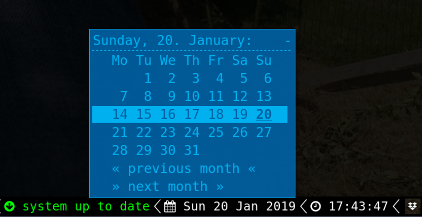
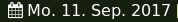

# rofi-calendar

Have a minimal calendar pop up in rofi when clicking the date blocklet (right click to show next month)




	
# Dependencies

* rofi 
* cal from util-linux package, supporting --color=always
# Installation

* Copy the script into your directory of choice, e.g. ~/.i3blocks/blocklets
* Give it execution permission (`chmod +x rofi-calendar`)
* Edit rofi launch options in the script to fit your needs
* Add the following blocklet to your i3blocks.conf:

```ini
[rofi-calendar]
command=$SCRIPT_DIR/rofi-calendar
interval=3600
#BAR_POSITION=bottom
#WEEK_START=monday
#DATEFTM=+%a %d %b %Y
#SHORTFMT=+%d/%m/%Y
#LABEL= 
#FONT=Monospace 10
#LEFTCLICK_PREV_MONTH=false
#PREV_MONTH_TEXT=« previous month «
#NEXT_MONTH_TEXT=» next month »
#ROFI_CONFIG_FILE=/dev/null
```
