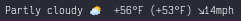
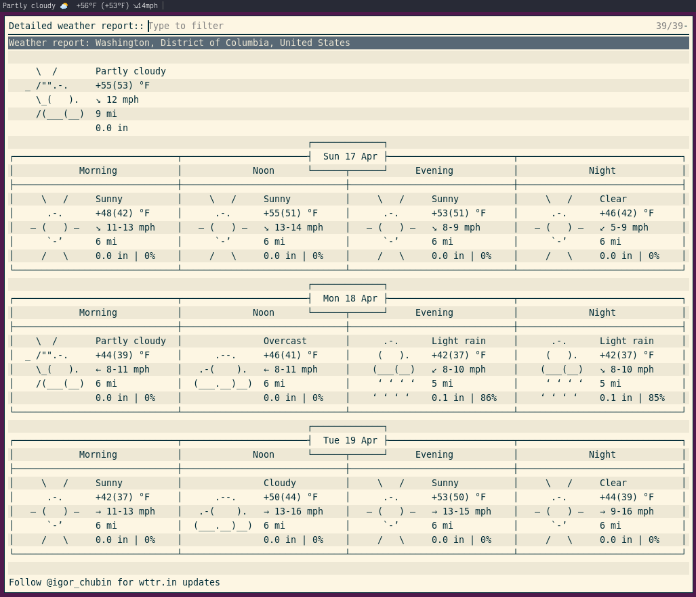

# rofi-wttr

A minimal weather line with forecast pop up on click. Using [rofi](https://github.com/davatorium/rofi) for the pop up and [wttr.in](https://wttr.in/) as the weather interface.


The statusbar


The popup with the default rofi theme

## Depencencies

* [rofi](https://github.com/davatorium/rofi)
* curl

## Installation

* Copy the script into your directory of choice, e.g. ~/.i3blocks/blocklets
* Give it execution permission (`chmod +x rofi-wttr`)
* Optional: Customize your rofi theme via the `rofi-theme-selector` command
* Optional: Customize the rofi launch options in the script
* Optional: Customize the wttr curl arguments in the script
* Add the following blocklet to your i3blocks.conf:

```ini
[rofi-wttr]
command=$SCRIPT_DIR/rofi-wttr
interval=3600
#BAR_POSITION=top
#FONT=Monospace 10
#LABEL=🌡️
#LOCATION=Washington_DC
#ROFI_CONFIG_FILE=/dev/null
```

## Thanks
Modeled off of [rofi-calendar](https://github.com/vivien/i3blocks-contrib/tree/master/rofi-calendar) with thanks to its authors.
