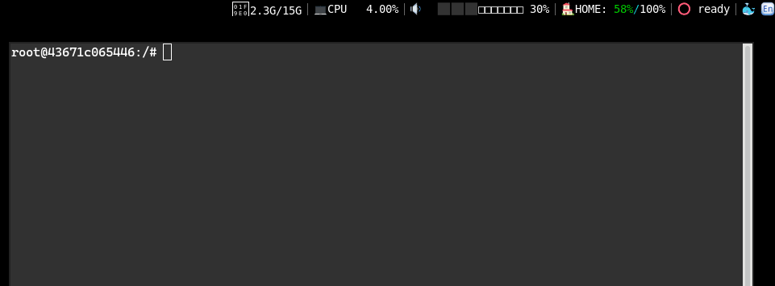

# screen-recorder

Record your desktop session to an animated GIF.

The recorded file will be opened in the browser.




# Requirements

- `byzanz-record`,
- `x-www-browser`,
- `nohup`
- `slop`

# Usage

```ini
[screen-recorder]
interval=once
```
