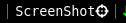

# screenshot

Shows the status of you microphone. Left and right click toggles mute.



# Usage

This block is run when clicked. It allows the user to capture a screenshot
in two mode
- Left Click - select a region to capture
- Right Click - capture the complete screen

It requires `ImageMagick` as dependency, which can be downloaded from your
official package manager.

# Config
```
[screenshot]
command=$SCRIPT_DIR/screenshot
full_text=ScreenShot 
FORMAT=png
#SAVE_DIR=< home dir >/screenshots
```
