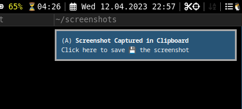

# screenshot (or snipping tool)

This i3block button provides an easy way to take screenshots (or snippets) with a single click. The captured screenshot is automatically copied to the clipboard and can also be saved in a file by clicking on an interactive notification (sent with dunstify) if enabled with the desired configurations.




# Usage

This block runs when clicked, and allows the user to capture a screenshot in two modes:
- Left Click: capture the selected region on screen
- Right Click: capture the complete screen

When button is clicked, the screenshot is first copied to clipboard. A notifiction is then sent using dunstify to alert user a screenshot is clicked. 

Interaction with notification will save the screenshot in specified SAVE\_DIR or ($HOME/screenshots if not specified)

# Dependency

This requires `ImageMagick`, `xclip`, `dunst` package as dependency, which can be downloaded from your official package manager.

Please ensure user has sufficient permission to write in SAVE\_DIR.

In the dunstrc configuration file, add the do\_action key to the desired mouse event. By default, this feature is only enabled for mouse middle clicks. The screenshot will be saved if the proper do\_action key is used to interact with the notification
```
# edit ~/.config/dunst/dunstrc or default dunstrc

    mouse_left_click = do_action, close_current
    mouse_middle_click = do_action, close_current
    mouse_right_click = do_action, close_all
```

# Config

```
# Setting the environment variable when calling script may not look elegant but it works!
# https://github.com/vivien/i3blocks/issues/470

[screenshot]
command=i3-msg -q exec -- SAVE_DIR="/path/to/dir/screenshots" IS_SAVE="true" BLOCK_BUTTON="$BLOCK_BUTTON" /path/to/script/screenshot/screenshot
full_text=ScreenShot 
```
