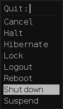
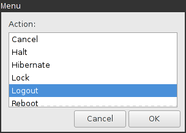

# shutdown_menu

Use rofi or zenity to change the system's runstate thanks to systemd.

The script can be used to shutdown, reboot, logout, lock etc.
It is inspired from an example in [i3pystatus' Wiki][i3pystatus].





# Requirements

- `systemd`,
- `rofi` or `zenity`,
- shell with associative array support.

# Usage

```
[shutdown_menu]
full_text=Quit
# If you are using FontAwesome, we recommend the power-off icon:
# http://fontawesome.io/icon/power-off/
command=$SCRIPT_DIR/shutdown_menu
#FG_COLOR=#bbbbbb
#BG_COLOR=#111111
#HLFG_COLOR=#111111
#HLBG_COLOR=#bbbbbb
#BORDER_COLOR=#222222
#ROFI_TEXT=Menu:
#ROFI_OPTIONS=-width 11 -location 3 -hide-scrollbar -bw 2
#ZENITY_TITLE=Menu
#ZENITY_TEXT=Action:
#ZENITY_OPTIONS=--column= --hide-header
#ENABLE_CONFIRMATIONS=true (must be true or false)
#LAUNCHER=rofi (must be rofi or zenity)
#LOCKSCRIPT=i3lock --color=${BG_COLOR#"#"}
```

Since `rofi` and `zenity` have mouse support, this can be integrated in
i3blocks with a clickable block. It can also be used directly from i3, for
instance:

```
bindsym Control+Mod1+Delete exec $SCRIPTDIR/shutdown_menu
```

For the i3blocks label to use, we recommend FontAwesome's
[power-off][power-off] icon.


[i3pystatus]: https://github.com/enkore/i3pystatus/wiki/Shutdown-Menu
[power-off]: http://fontawesome.io/icon/power-off
