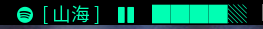

# Spotifyd dbus status
Show song currently played on Spotifyd

And provide simple control(Click to pause/start).


## requirement
require dbus-python package.

require spotifyd with dbus support. (For Arch user is "spotifyd-full-git" in AUR)

## example config
```
[spotify]
min_width=Buttom=?
command=$SCRIPT_DIR/spotifyd_dbus $buttom
color=#00FFB3
interval=10
```

