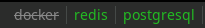

# systemctl

Show systemctl service status, allows to toggle status with left click.
Accepts the same service names as systemctl eg. "redis" or "docker".



# Config

```
[systemctl]
command=$SCRIPT_DIR/systemctl
interval=once
markup=pango
instance=docker

[systemctl]
command=$SCRIPT_DIR/systemctl
interval=once
markup=pango
instance=redis

[systemctl]
command=$SCRIPT_DIR/systemctl
interval=once
markup=pango
instance=postgresql
```
