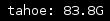

# tahoe-lafs

Check on the status of your tahoe-lafs grid.



# Requirements

Dependencies: bash, curl, jq, tahoe-lafs (unless using a remote node)

# Usage

Copy the `i3blocks.conf` section into your i3blocks configuration.
The `node.url` of a node in the grid you want the status of should be set as the `instance`
variable to the blocklet.

```
[tahoe-lafs]
command=$SCRIPT_DIR/tahoe-lafs
instance=localhost:3456
interval=3600
```
