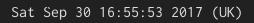

# time

Shows the current time and changes displayed timezone on click.



# Dependencies

perl

# Installation

To use with i3blocks, copy the below configuration into your i3blocks configuration file

```INI
[time]
command=$SCRIPT_DIR/time
interval=1
#TZ_FILE=~/.tz
STRFTIME_FORMAT=%Y-%m-%d %H:%M
TZONES=$DEFAULT_TZ,Brazil/East,Australia/Brisbane,Asia/Calcutta
TZ_LABELS=,Brazil,AU,Hyderabad
```

See [strftime](https://linux.die.net/man/3/strftime) for allowed strftime formats.

Here TZONES is a comma separated list of timeszones, see /usr/share/zoneinfo (Olson DB)
for allowed timezones. One exception is that the string $DEFAULT_TZ
is also allowed and represents whatever your current system timezone is.

Also TZ_LABELS is a comma separated list of how to label each timezone in case you prefer
not to see the full timezone as part of the label.
E.g. you may want it to say "12:34 (US)" instead of "12:34 (America/Chicago)".
Labels are allowed to be empty,
in which case the script omits parentheses.
For example, in the config above, the label for the default timezone is omitted.
