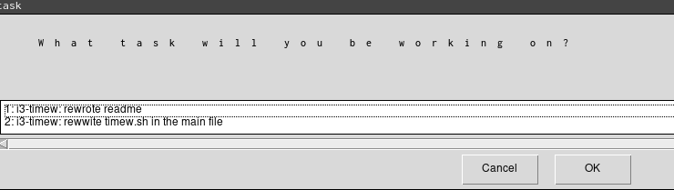
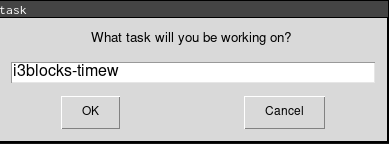

# Timew

Interact with [timewarrior](https://timewarrior.net/) and [taskwarrior](https://taskwarrior.org/)
directly from i3blocks.


Integrated with [taskwarrior](https://taskwarrior.org), will allow to choose a pending task if any.



If there is no pending task or the user click on "cancel", a second floating window
allows to input the task name.



Show current task time when active.


# Install

`pip install -r requirements.txt`

Two dependencies are required for this blocklet:

* easygui: draw the windows
* tasklib: interact with [taskwarrior](https://taskwarrior.org/)

# Config

## i3blocks

```
[timew]
interval=10
signal=10
```

## i3

In order to have a floating window with i3.

```
# for python easygui
for_window [title="task" class="Tk"] floating enable
```

# Upstream repository

The upstream repository is located on GitHub at [maggick/i3blocks-timew](https://github.com/maggick/i3blocks-timew).
