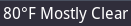

# weather_NOAA

Retrieve short term forecast from NOAA.
Since the forecast is from NOAA, this script only works within the USA.



# Dependencies

* `curl`
* `JSON` perl module, can be found in CPAN

# Usage

``` ini
[weather_NOAA]
command=$SCRIPT_DIR/weather_NOAA/weather_NOAA
#LAT=45.52
#LON=-122.6819
interval=600
```
