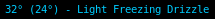
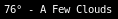

Fetches current temperature and weather from the [US National Weather Service](https://weather.gov/) (NWS).
Clicking opens a browser with the weather forecast from https://forecast.weather.gov.

## Dependencies
* python3
* [defusedxml](https://pypi.org/project/defusedxml/) Python module (`pip install defusedxml`)

## Properties
### LOCATION
NWS location call sign (ex: `KNYC` for New York City, Central Park).  
Find your location at  
https://w1.weather.gov/xml/current_obs/

### UNITS
Temperature units, `f`/`fahrenheit` or `c`/`celsius`.

### FORMAT
Long output format string.

#### Format variables

* `{temperature}` - Temperature.
* `{weather}` - Weather description (e.g. Partly Cloudy).
* `{deg}` - Degree symbol `°`.

Default value: `{temperature}{deg} - {weather}`

### SHORT\_FORMAT
Short output format string.
Format variables are the same as for [**FORMAT**](#FORMAT).

Default value: `{temperature}{deg}`

### FORMAT\_WIND\_CHILL
Long output format used if wind chill temperature is being displayed (see [**DISPLAY\_WIND\_CHILL**](#DISPLAY_WIND_CHILL).
Format variables are the same as for [**FORMAT**](#FORMAT), with the addition of the variable `wind_chill`.

Default value: The [**FORMAT**](#FORMAT) variable if specified.
If not then `{temperature}{deg} ({wind_chill}{deg}) - {weather}`.

### SHORT\_FORMAT\_WIND\_CHILL
Short output format used if wind chill temperature is being displayed.
Format variables are the same as for [**FORMAT\_WIND\_CHILL**](#FORMAT_WIND_CHILL).

Default value: The [**SHORT\_FORMAT**](#SHORT_FORMAT) variable if specified.
If not then `{temperature}{deg} ({wind_chill}{deg})`.

### COLOR\_LOW\_THRESHOLD

Temperature threshold at or below which to change text color to [**COLOR\_LOW**](#COLOR_LOW) property value, in [**UNITS**](#UNITS) units.

Default Value: `32` F or `0` C (dependent on [**UNITS**](#UNITS) property).

### COLOR\_LOW
Text color when temperature is at or below [**COLOR\_LOW\_THRESHOLD**](#COLOR_LOW_THRESHOLD).

Format: `#RRGGBB`

Default Value: `#00CCFF` (light blue)

### COLOR\_HIGH\_THRESHOLD
Temperature threshold at or above which to change text color to [**COLOR\_HIGH**](#COLOR_HIGH) property value, in [**UNITS**](#UNITS) units.

Default Value: `90` F or `30` C (dependent on [**UNITS**](#UNITS) property).

### COLOR\_HIGH
Text color when temperature is at or above [**COLOR\_HIGH\_THRESHOLD**](#COLOR_HIGH_THRESHOLD).

Format: `#RRGGBB`

Default Value: `#FF5555` (light red)

### DISPLAY\_WIND\_CHILL
`True` or `False` value specifying whether to display wind chill temperature when available.

See [**FORMAT\_WIND\_CHILL**](#FORMAT_WIND_CHILL) and [**SHORT\_FORMAT\_WIND\_CHILL**](#SHORT_FORMAT_WIND_CHILL).

## Notes
* If displaying wind chill temperature, that value will be used instead of the current temperature to compare to the [**COLOR\_LOW\_THRESHOLD**](#COLOR_LOW_THRESHOLD) value.
