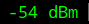

# wlan-dbm

Show wifi interface link quality in dBm or percent.



# Usage

The block uses dBm by default, set USE_PERCENT=1 to use percent.
Note, however, that percent is just an estimate that may not accurately predict
whether you have a good signal.

# Dependencies

* `iw`

# Config

```INI
[wlan-dbm]
command=$SCRIPT_DIR/wlan-dbm
#IFACE=wlan0
#USE_PERCENT=0
```
